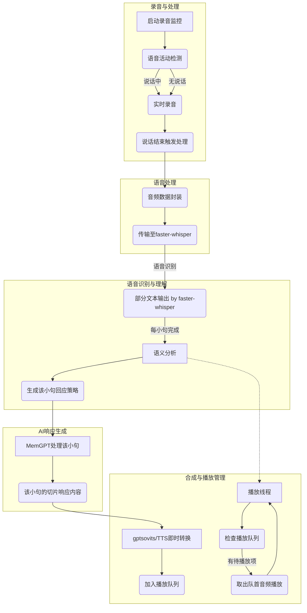

# 关于
全平台的ai语音聊天客户端

```mermaid
graph TD;
    subgraph 录音与处理
        A[启动录音监控] --> B(语音活动检测);
        B -->|说话中| C(实时录音);
        B -->|无说话| C;
        C --> D(说话结束触发处理);
    end

    subgraph 语音处理
        D --> E(音频数据封装);
        E --> F(传输至faster-whisper);
    end

    subgraph 语音识别与理解
        F -->|语音识别| G(部分文本输出 by faster-whisper);
        G -->|每小句完成| H[语义分析];
        H --> I(生成该小句回应策略);
    end

    subgraph AI响应生成
        I --> J[MemGPT处理该小句];
        J --> K(该小句的切片响应内容);
    end

    subgraph 合成与播放管理
        K --> L[gptsovits/TTS即时转换];
        L --> M(加入播放队列);

        N[播放线程] --> O(检查播放队列);
        O -->|有待播放项| P(取出队首音频播放);
        P --> N;
    end

    H -.-> N;

```

# 开发进度
- [x] 语音活动检测
- [ ] 前端UI
- [ ] 相关api封装
  - [ ] faster-whisper/TTS
  - [ ] MemGPT/GPT后端
  - [ ] gptsovits/TTS后端
- [ ] 应答模块
  - [ ] 队列合成
  - [ ] 队列播放

# 注意
本项目处于概念开发阶段
